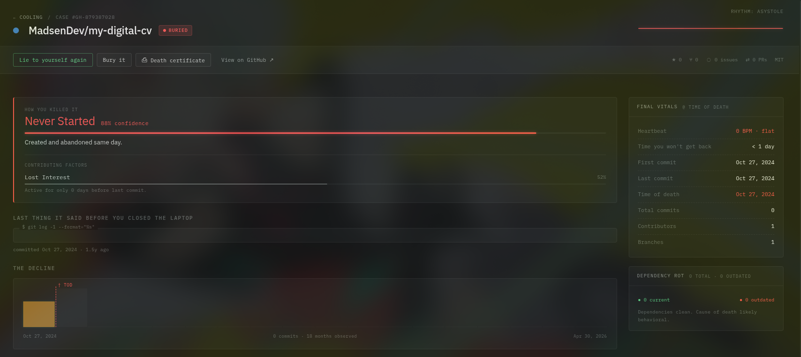

# Dead Repo

> Autopsy your abandoned GitHub repositories.

Dead Repo monitors the vital signs of every project on your GitHub account — classifying, autopsying, and issuing death certificates for the ones that didn't make it.



## Features

- **Triage dashboard** — live overview of alive, fading, flatlined, and declared-dead repos
- **Autopsy view** — differential diagnosis with multi-cause confidence scoring, commit timeline, file decay heatmap, dependency toxicology
- **Death certificates** — printable/exportable, voice-aware, stamped DECEASED
- **5 personality voices** — Neutral, Monday (brutal), Super Supportive (unhinged), Surfer, Professional
- **GitHub OAuth** — real live data via read-only scopes (`repo`, `read:user`, `read:org`)
- **Year in review** — Spotify Wrapped–style breakdown of your year in abandoned projects

## Stack

- **Electron** + **React** + **Vite**
- GitHub OAuth via local callback server (client secret stays in main process)
- CSS custom properties + oklch color system
- IBM Plex Mono / IBM Plex Sans

## Getting Started

### Prerequisites

- Node.js 18+
- A GitHub OAuth app ([create one here](https://github.com/settings/developers))
  - Callback URL: `http://localhost:3000/callback`

### Install

```bash
npm install
```

### Configure

Set your GitHub OAuth credentials in the environment before starting the app:

```bash
export GITHUB_CLIENT_ID=your_client_id
export GITHUB_CLIENT_SECRET=your_client_secret
# optional if you need a non-default callback
export GITHUB_REDIRECT_URI=http://localhost:3000/callback
```

### Run

```bash
npm run dev
```

### Build

```bash
npm run build
```

Output goes to `release/`.

## OAuth Scopes

| Scope | Why |
|---|---|
| `repo` | Read repository metadata, commits, branches |
| `read:user` | Read your profile (name, avatar) |
| `read:org` | List organizations and their repos |

The client secret never reaches the renderer process — token exchange happens entirely in the Electron main process.

## Repo Classification

| State | Condition |
|---|---|
| Alive | Last push ≤ 30 days ago |
| Fading | Last push 31–90 days ago |
| Flatlined | Last push 91–365 days ago |
| Dead | Last push > 365 days ago, or archived |

## Cause of Death

Repos are diagnosed against 11 independent signals — each scored 0–100% confidence. Up to 3 contributing causes are surfaced per repo.

Signals: `Never Started`, `Existential Crisis`, `Experiment / POC`, `Lost Interest`, `Scope Inflation`, `Maintenance Fatigue`, `Burnout`, `Abandoned`, `Superseded`, `Archived`, `Shipped & Archived`.

## License

MIT
